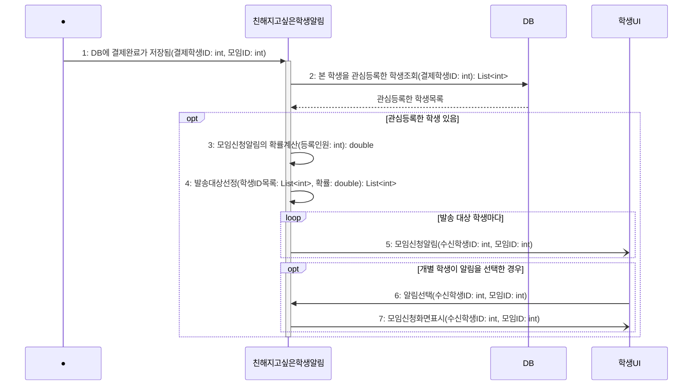

# seq-03 친해지고싶은학생알림

## 참여 객체

| 객체 | 종류 | 클래스 파일 |
|---|---|---|
| 친해지고싶은학생알림 | 담당 객체 | classes/CloseStudentNotification.md |
| DB | DB | classes/InterestRegistrationDB.md |
| 학생UI | UI | classes/StudentUI.md |

시작 방식: **데이터 변화** (DB에 신청 상태 '결제완료'가 저장됨) → Found Message

## 다이어그램

```mermaid
sequenceDiagram
    participant Found as ●
    participant 알림 as 친해지고싶은학생알림
    participant DB as DB
    participant 학생UI as 학생UI

    Found->>+알림: 1: DB에 결제완료가 저장됨(결제학생ID: int, 모임ID: int)
    알림->>DB: 2: 본 학생을 관심등록한 학생조회(결제학생ID: int): List<int>
    DB-->>알림: 관심등록한 학생목록

    opt 관심등록한 학생 있음
        알림->>알림: 3: 모임신청알림의 확률계산(등록인원: int): double
        알림->>알림: 4: 발송대상선정(학생ID목록: List<int>, 확률: double): List<int>
        loop 발송 대상 학생마다
            알림-)학생UI: 5: 모임신청알림(수신학생ID: int, 모임ID: int)
        end
        opt 개별 학생이 알림을 선택한 경우
            학생UI->>알림: 6: 알림선택(수신학생ID: int, 모임ID: int)
            알림-)학생UI: 7: 모임신청화면표시(수신학생ID: int, 모임ID: int)
        end
    end
    deactivate 알림
```

## 메시지 ↔ Action 대응표

| 메시지 | Action |
|---|---|
| 1~2 | 1, 2 |
| 3 | 3 |
| 4~5 | 4, 5 |
| 6~7 | 6 |

## 메모

- 1번 시작 메시지는 '2-2. 결제 및 신청 확정'에서 DB에 '결제완료' 상태가 저장될 때 발생하는 Found Message다.
- 3번 알림 확률 계산식은 $p = 1 / n$ (등록인원 $n$)이다.
- 5번 모임신청알림은 알림 권한이 허용된 학생에게만 발송된다.
- 6~7번은 알림을 수신한 개별 학생마다 각자 독립적·비동기적으로 알림을 눌러 해당 모임 신청 화면으로 이동하는 선택 시나리오다. 알림을 누르지 않으면 아무 동작 없이 종료되므로 `opt`로 감쌌다.

